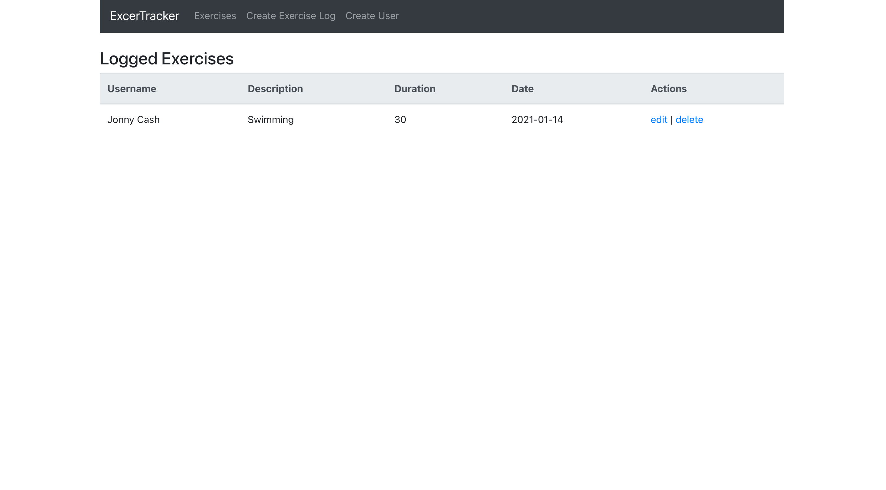
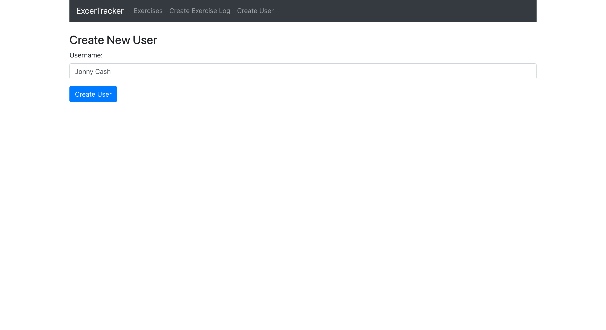
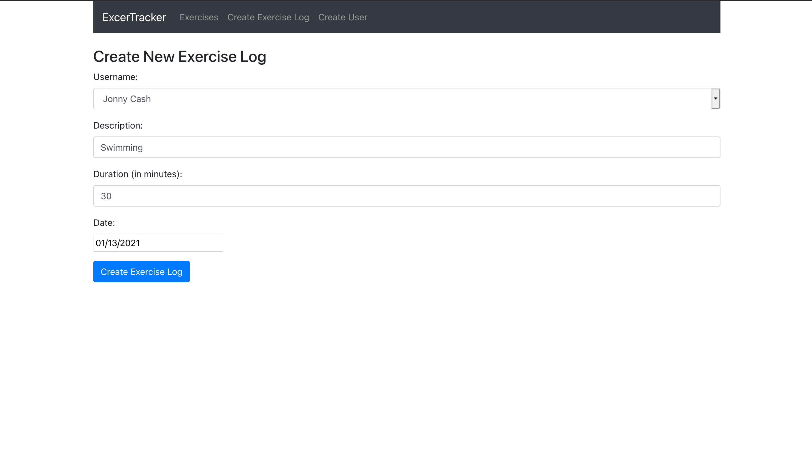
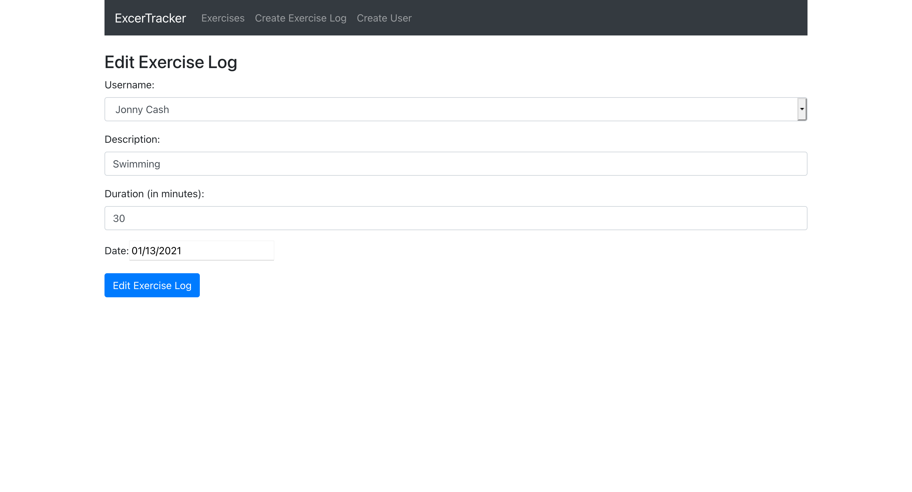

# Excercise-Tracker
This is a crud application built on a MERN Stack.
 
It supports the following operations:
<ol>
  <li>
    A User can be created.
  </li>
  <li>
    A user may enter excercises.
  </li>
  <li>
    A user my edit/delete an excercise
  </li>
</ol>

Here are some application screen shots

<h3>Home Page</h3>
</img>
<h3>Add User</h3>
</img>
<h3>Add Exercise</h3>
</img>
<h3>Edit Exercise</h3>
</img>
